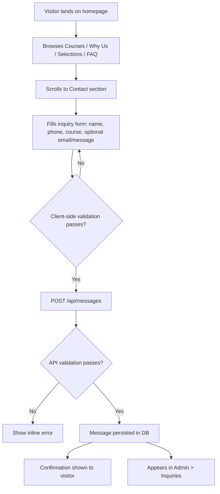
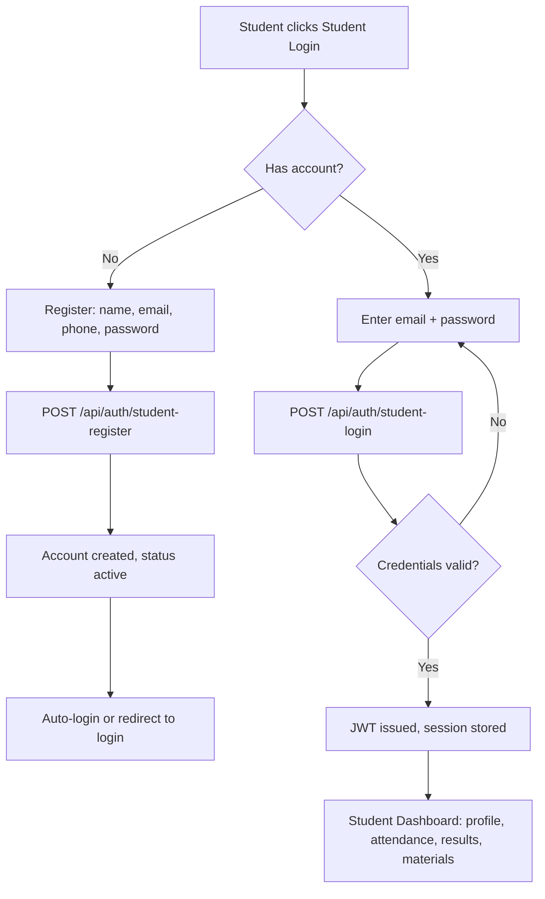
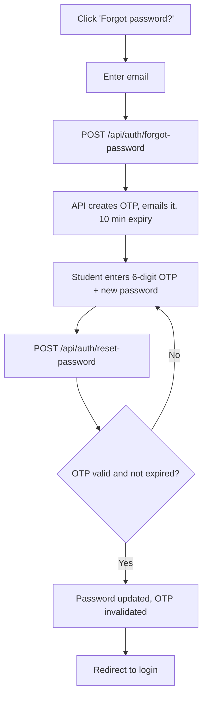
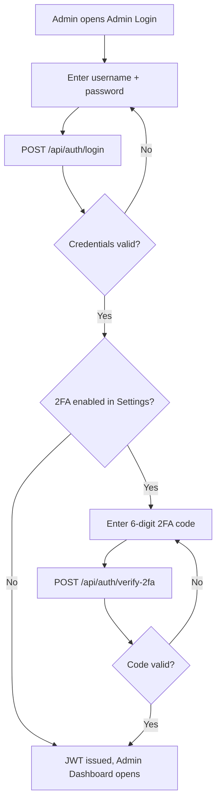
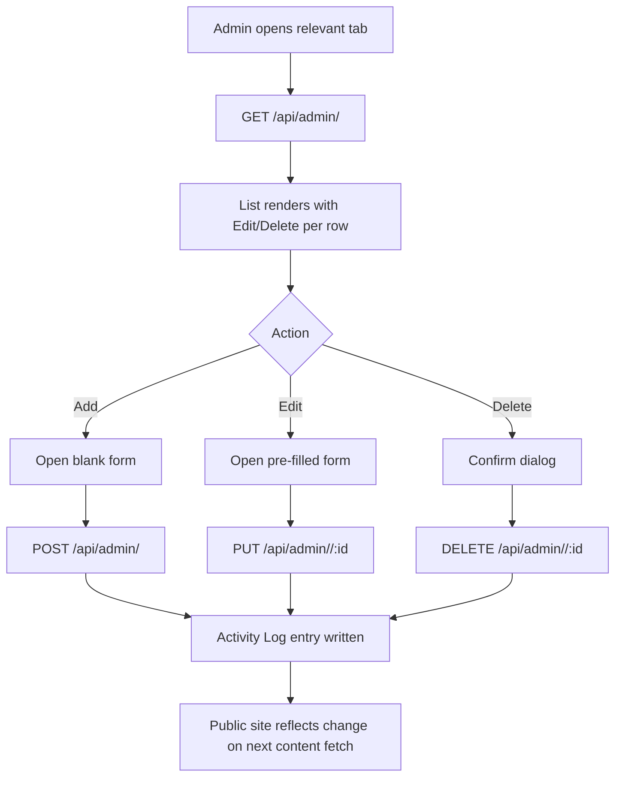
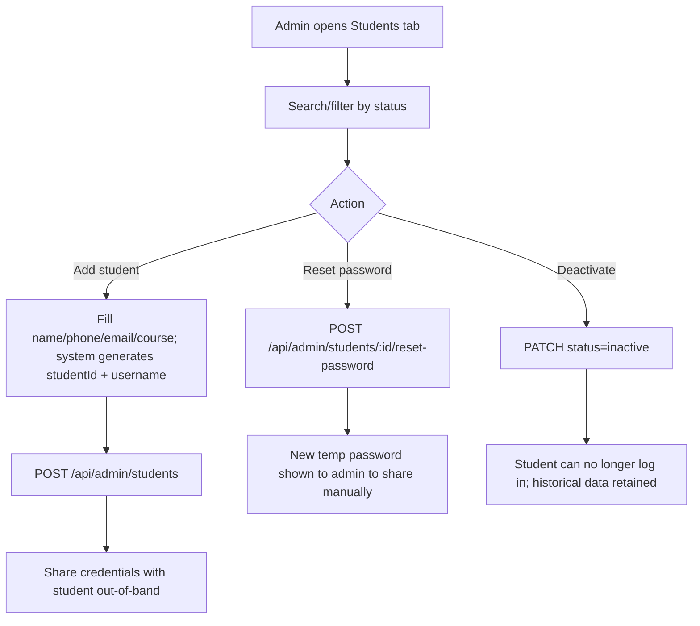
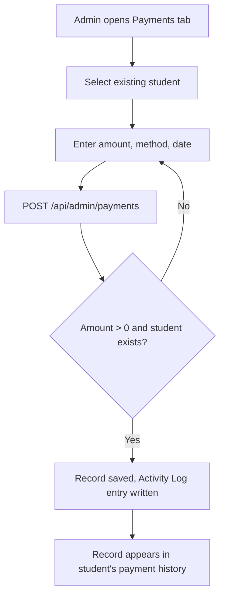
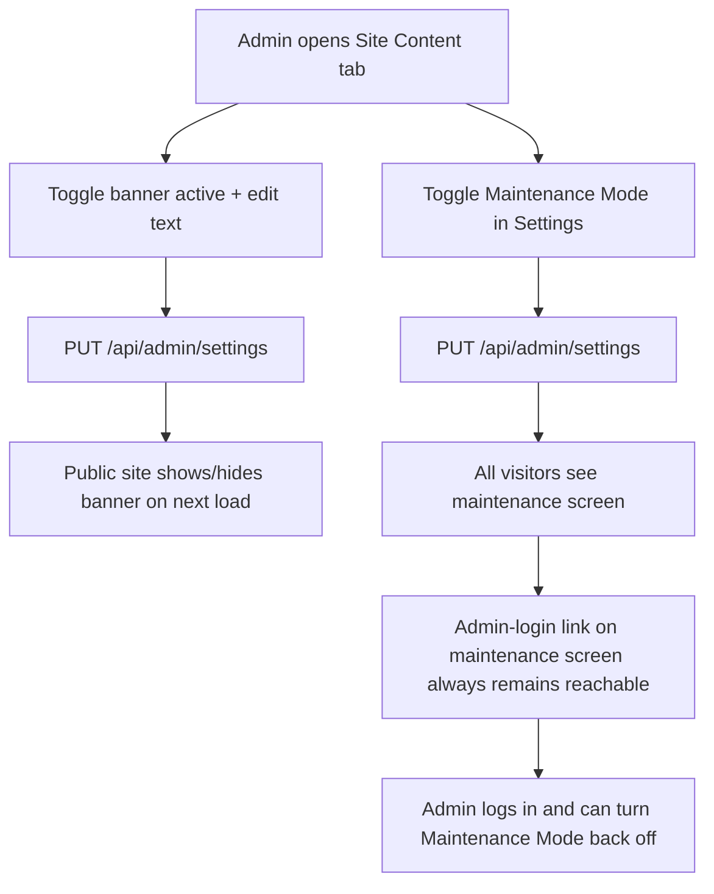
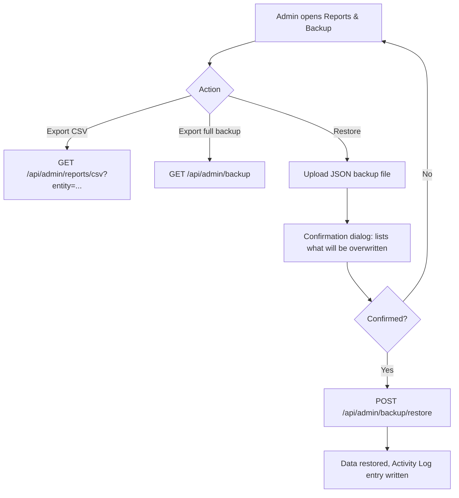

# 06 — App Flow Document
### GVC Sainik SSB Academy

**Status:** Draft v1.0
**Last updated:** 2026-07-14

---

## 1. Visitor → Inquiry Submission

## 2. Student Registration & Login

## 3. Student — Forgot Password

## 4. Admin Login (with optional 2FA)

## 5. Admin — Editing Public Content (generic CRUD flow, applies to Courses / Faculty / Selections / Testimonials / FAQs)

## 6. Admin — Managing a Student

## 7. Admin — Recording a Payment

## 8. Site-Wide Banner / Maintenance Mode

## 9. Backup & Restore

